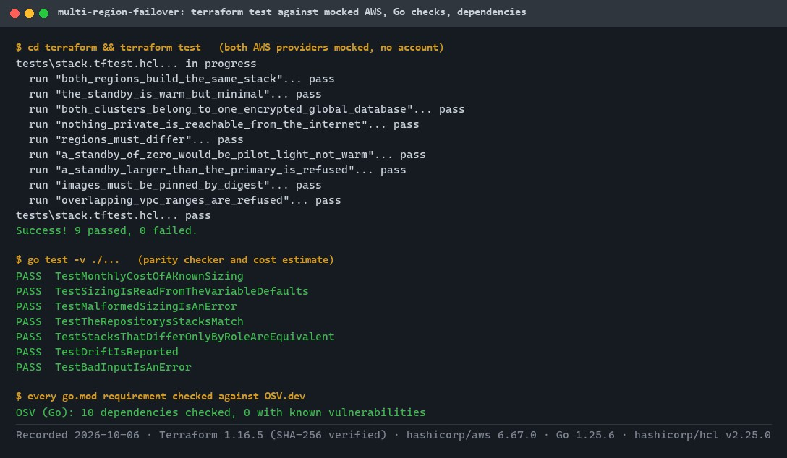
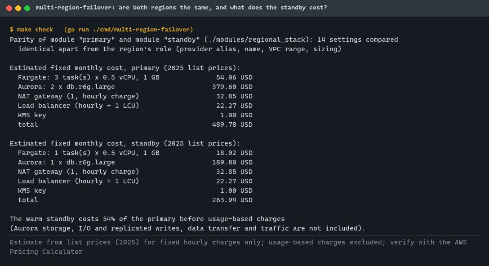
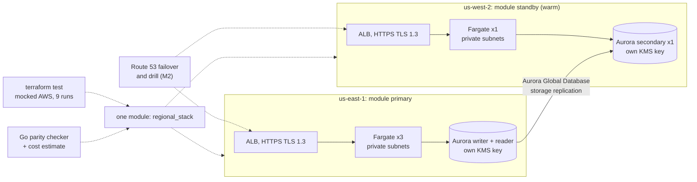
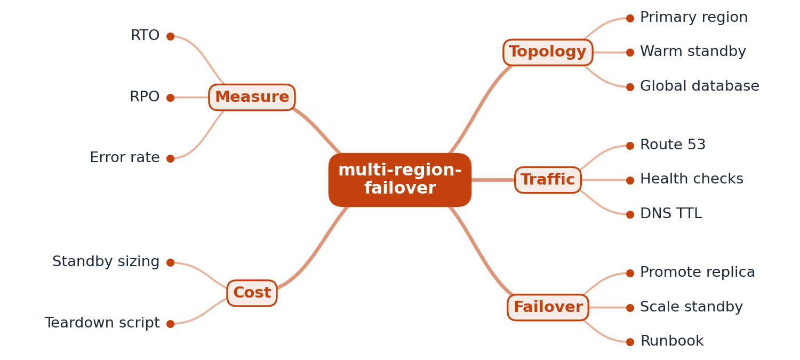
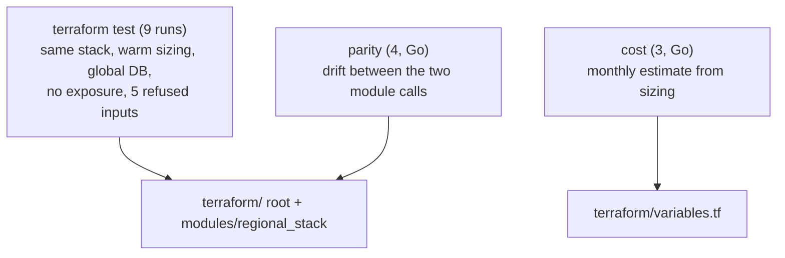

# multi-region-failover

[](https://github.com/EquinoxWN/multi-region-failover/actions/workflows/ci.yml)


> A warm standby in a second AWS region, built from the same Terraform module as the primary and checked without an AWS account: mocked terraform tests, a parity check that keeps the regions identical, and the standby's cost (54% of the primary).

Part of my **DevOps and Cloud** list · HCL · Go · core project

## Proof it works

Both regions are planned and applied with mocked AWS providers, so every check runs in seconds without an AWS account: identical stacks, a warm standby, one encrypted global database, nothing private exposed, and five kinds of bad input refused. Three deliberately injected mistakes (public database, standby outside the global database, public task IPs) each fail a run:



The parity checker confirms the two module calls differ only by role, and the sizing gives the standby's estimated fixed cost: about 54% of the primary:



## Architecture

**What M1 runs today:**



**Full roadmap (M1 to M3):**



## How it works

_Steps 1 and 2 are written and checked offline against mocked AWS providers (M1); nothing has run in a real AWS account yet. The rest is on the [roadmap](#roadmap)._

1. Terraform builds identical stacks in two regions; the standby runs at minimal size (warm standby).
2. An Aurora Global Database joins the two regions' clusters, so the standby receives the primary's writes; its replication lag is measured in the M3 drill.
3. Route 53 health checks watch the primary and shift DNS to the standby when it fails.
4. A drill script simulates a regional outage, promotes the secondary database and scales the standby while k6 keeps sending traffic.
5. The drill measures RTO (time until serving again) and RPO (writes lost) from request logs.
6. A runbook and a teardown script keep the lab reproducible and cheap.

## Who it helps

- **Who:** Teams planning disaster recovery on AWS.
- **The problem:** A standby region drifts from the primary over time, and checking it usually means paying for a real deployment.
- **How to use it:** Build both regions from one Terraform module and check them offline with mocked `terraform test` runs, a parity check and a cost estimate; nothing has run in a real AWS account yet.

## Tech stack

| Area | In M1 | Planned |
|---|---|---|
| IaC | Terraform root module and one regional module, `terraform test` with mocked AWS providers | - |
| Data / traffic | Aurora PostgreSQL Global Database, HTTPS load balancers | Route 53 health-check failover |
| App / drill | API on ECS Fargate, Go parity and cost checker | Scripted failover drill with k6 load, a run in a real AWS account |

Languages: **HCL** (Terraform) and **Go**. The infrastructure is in [`terraform/`](terraform) (root module with the global database and both regions, [`modules/regional_stack`](terraform/modules/regional_stack), [`tests`](terraform/tests)); the checker is in [`internal/`](internal) (`parity`, `cost`) with its command in [`cmd/multi-region-failover`](cmd/multi-region-failover).

## Run it

**Prerequisites:** Go 1.25+, `curl` and `unzip`. No AWS account is needed for anything in M1: `make setup` downloads the pinned Terraform (1.16.5) into `.tmp/bin`, checked against HashiCorp's SHA-256 sums, and the tests mock both AWS providers.

```bash
make setup   # Go modules, Terraform, terraform init (AWS provider)
make lint    # gofmt, go vet, terraform fmt -check, terraform validate
make test    # 7 Go tests, then terraform test (9 runs against mocked AWS)
make check   # parity of the two stacks and the estimated monthly cost of each
make audit   # govulncheck
```

Deploying for real (M3) needs an AWS account, two ACM certificates and an image pushed by digest: `terraform apply -var app_image=...@sha256:... -var 'certificate_arns={primary="...",standby="..."}'`. Everything has deletion protection, so a teardown script comes with the drill.

## Tests and results

Full numbers, the injected-bug checks and the outputs: [docs/results/m1.md](docs/results/m1.md).

| Check | Result |
|---|---|
| Tests (`make test`) | **16 passed**: 7 Go tests and 9 `terraform test` runs, 0 failed |
| Both regions | same module, image digest, engine version, zones and TLS policy; warm standby of one task and one database instance |
| Security | encrypted, deletion-protected global database; per-region rotating KMS keys; no public database or task IPs; database reachable only from the API |
| Refused inputs | same region twice, standby of zero, standby larger than primary, image tag instead of digest, overlapping VPC ranges |
| Do the tests catch bugs? | public database instances, a standby outside the global database and public task IPs each fail a test run |
| Standby cost (estimate, list prices) | 263.94 USD a month, 54% of the primary's 489.78 USD, before usage-based charges |
| Lint / audit | gofmt, go vet, terraform fmt and validate clean; Go modules clean on OSV.dev; govulncheck clean |

### Test map



## Roadmap

**M1** (≈15 h)
- [x] Write `docs/rfc/0001-design.md`: problem, goals, non-goals, chosen design
- [x] Terraform builds identical stacks in two regions; the standby runs at minimal size (warm standby).
- [x] An Aurora Global Database joins the two regions' clusters, so the standby receives the primary's writes; its replication lag is measured in the M3 drill.

**M2** (≈20 h)
- [ ] Route 53 health checks watch the primary and shift DNS to the standby when it fails.
- [ ] A drill script simulates a regional outage, promotes the secondary database and scales the standby while k6 keeps sending traffic.

**M3** (≈25 h)
- [ ] The drill measures RTO (time until serving again) and RPO (writes lost) from request logs.
- [ ] A runbook and a teardown script keep the lab reproducible and cheap.
- [ ] Publish the proof below with real numbers

## Proof

What this repo must show before it counts as done:

- A drill report with measured RTO and RPO, and the monthly cost of the standby.

| Result | Value |
|---|---|
| M3 proof above | Not measured yet (M3). Current M1 numbers: see [Tests and results](#tests-and-results). |

## Why it matters

- **Interview angle:** 'Design for a region outage': RTO, RPO and cost.
- **Upstream I'd like to contribute to:** terraform-aws-modules.

## Design docs

- [RFC 0001: design](docs/rfc/0001-design.md)
- [ADR 0001: record architecture decisions](docs/adr/0001-record-architecture-decisions.md)
- [ADR 0002: warm standby with Aurora Global Database](docs/adr/0002-warm-standby-with-aurora-global-database.md)
- [ADR 0003: verify offline with mocks and a parity check](docs/adr/0003-verify-offline-with-mocks-and-a-parity-check.md)
- [M1 results](docs/results/m1.md)

## Scope

This is a learning and portfolio system, not a hosted production service. Everything runs locally.

## Security and contributing

- Every GitHub Action is pinned to a commit SHA; workflows run read-only, without persisted credentials.
- Dependabot proposes dependency and action updates weekly.
- The database master password is generated and kept in Secrets Manager by AWS (`manage_master_user_password`), never in Terraform variables or state; Terraform itself is downloaded at a pinned version and checksum-verified; Dependabot also watches the Terraform provider; CI runs `govulncheck` on every push.
- Report vulnerabilities privately: see [SECURITY.md](SECURITY.md). To contribute, see [CONTRIBUTING.md](CONTRIBUTING.md).

## License

MIT, see [LICENSE](LICENSE).
